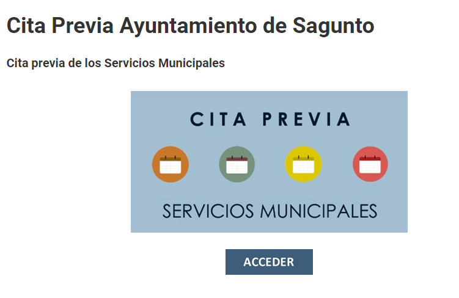
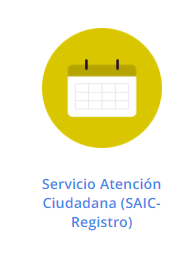
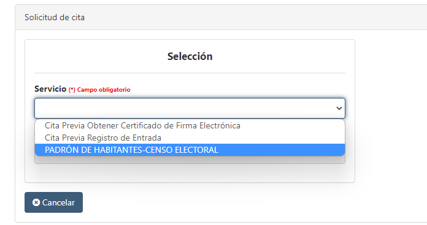

# Trámites online
Contiene información útil para realizar trámites online en Argentina, España e Italia.

## Argentina 
### Antigüedad carnet de conducir (Mendoza)

Se solicita a la siguiente dirección de 
[email](mailto:direcvial@gmail.com):
> direcvial@gmail.com

El correo electrónico debe contener:
- Por este medio solicito turno para obtener certificado antigüedad carnet de conducir.
- Colocar Número DNI
- Nombre Apellido completo
- Foto del carnet de conducir **frente** y **reverso**

### Otros Trámites

[Partidas Nacimiento, Matrimonio Mendoza](https://partidasdigitales.mendoza.gov.ar/pedidosreg/)
 
[Apostilla de la HAYA - Trámites a distancia](https://tramitesadistancia.gob.ar/#/inicio)

[Firma Digital, Mendoza, Lujan](https://lujandecuyo.gob.ar/2020/05/20/ahora-en-lujan-de-cuyo-se-puede-tramitar-la-firma-digital/)

## España

### Empadronamiento Puerto Sagunto
[Cita Previa](https://aytosagunto.es/es/el-municipio/servicios-de-interes/cita-previa-ayuntamiento-sagunto/)

Menú principal:

Seleccionar atención ciudadana:

En el desplegable seleccionar Padrón de habitantes:

### Firma electrónica (Sagunto)
**Muy importante para agilizar las comunicaciones con la administración pública.**

[Detalle](https://aytosagunto.es/sede/es/como-obtener-tu-certificado/#:~:text=Para%20obtener%20un%20certificado%20de,46500%20Sagunto)

[Cita Previa](https://www.gva.es/es/web/atencio_ciutadania/inicio/atencion_ciudadano/citapreviaPROP)

### Oficina Extranjería
Comunicarse al siguiente [email](mailto:citaextran.valencia@correo.gob.es):
> citaextran.valencia@correo.gob.es

[Cita comunitarios](mailto:citacomunitarios.valencia@correo.gob.es)
> citacomunitarios.valencia@correo.gob.es

### Otros Trámites

[Administración Pública](https://sede.administracionespublicas.gob.es/)

[Cita NIE, CUE, TIE - Administración pública](https://sede.administracionespublicas.gob.es/pagina/index/directorio/icpplus)

[Registro Civil Sagunto - Cita Previa](https://registrocivil.gva.es/es/cita-previa)

[Ciudadanía](https://www.mjusticia.gob.es/es/ciudadania)

[Agencia Tributaria](https://sede.agenciatributaria.gob.es)

[Seguridad Social](https://sede-tu.seg-social.gob.es/wps/portal/tussR/tuss/Login/)

[Empadronamiento con Firma Electrónica](https://aytosagunto.es/es/el-municipio/servicios-de-interes/servicios-para-la-ciudadania/solicitud-certificado-de-empadronamiento/)

[Empadronamiento Colectivo](https://sagunt.sedipualba.es/carpetaciudadana/tramite.aspx?idtramite=15235)

[Certificado de antecedentes penales](https://sede.mjusticia.gob.es/es)

[DGT](https://sede.dgt.gob.es/es/)

### Homologar títulos

Ver antes de iniciar el trámite:
[Información](https://www.youtube.com/watch?v=RFYm1320xuk)
[Más info](https://www.educacionyfp.gob.es/argentina/reconocimiento-de-titulos/informacion-general.html)

Requerimientos:

1. Impreso de la solicitud de homologación para títulos extranjeros no universitarios.    
2. Pasaporte.
3. Título secundario o documentación académica equivalente.
4. Certificado analítico de estudios.
5. Escala de calificaciones numéricas.
6. Pago de tasas por apertura expediente 790.
    
**Nota:** Todo en tamaño A4
Para iniciar estudios se debe presentar al ministerio de Educación de España: **Volante de inscripción condicionada**

Apostillar: 
- Título
- Analítico
- Escala numérica

[Iniciar trámite](https://sede.educacion.gob.es/sede/login/inicio.jjsp?idConvocatoria=46)

## Italia
[FastIt](https://serviziconsolari.esteri.it/ScoFE/index.sco)

[Consulado de Mendoza](https://consmendoza.esteri.it/es/)

[Consulado de Barcelona](https://consbarcellona.esteri.it/es/)

